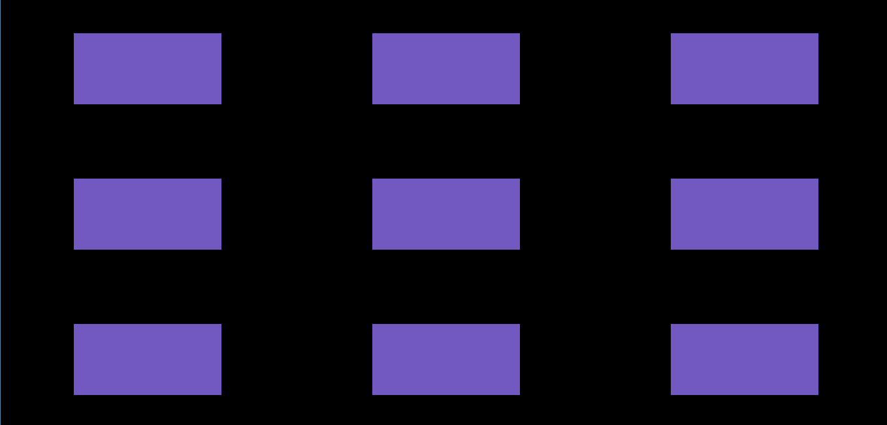
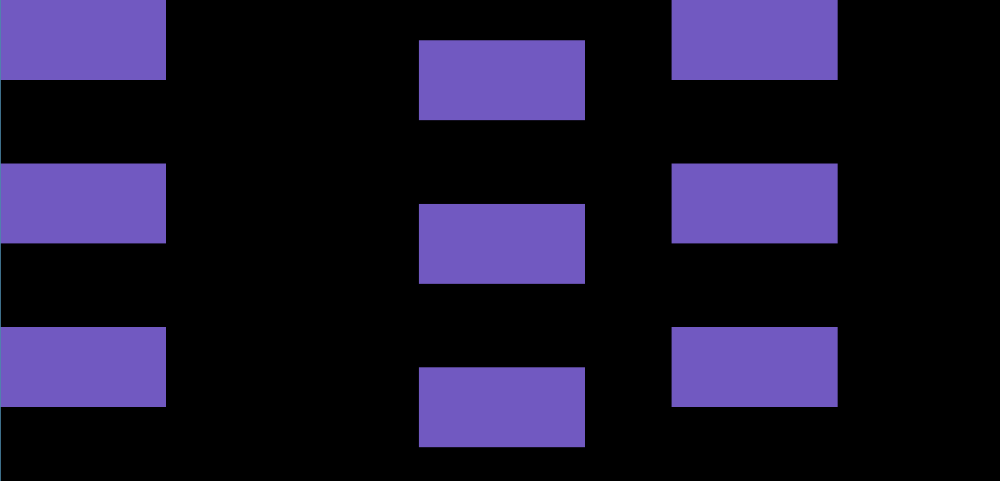
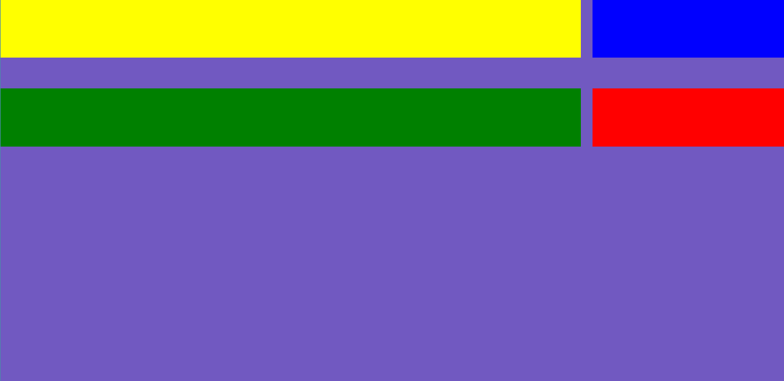
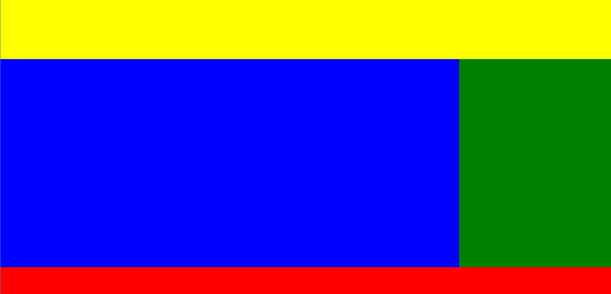

# Desvendando CSS Grid

## Grid

- Bimensional
- Divisão de toda a página em linhas e colunas
- Colocar elementos onde quiser nessa divisão

## Grid ou Flexbox

- Grid: Duas dimensões (colunas e linhas)
- Flexbox: Uma dimensão (ou coluna ou linha)
- Um complementa o trabalho do outro
- Verificar quais navegadores ainda não estão aceitando o Grid

## Propriedades

Vamos separar em 2 grupos:
`container` e `item(s)`

### Container

- display: grid;
- grid-template-columns;
- grid-template-rows;
- grid-gap
  - grid-row-gap
  - grid-column-gap
- grid-template-areas;

...e mais 4 propriedades de alinhamento.

## Item(s)

- grid-column
  - grid-column-start
  - grid-column-end
- grid-row
  - grid-row-start
  - grid-row-end
- grid-area

...e mais 2 propriedades de alinhamento.

---

### Alinhamento

Existem 6 propriedades para alinhamento:

1. `justify-content`
2. `align-content`
3. `justify-items`
4. `align-items`
5. `justify-self`
6. `align-self`

Vamos separá-los em 2 grupos

1. `justify` e `align`
2. `content`, `items` e `self`

#### Justify e Align

Sabendo que o grid é bidimensional, nós temos o eixo x e o y.

O **eixo x** é o posicionamento horizontal, da esquerda para a direita.

O **eixo y** é o posicionamento vertical, de cima para baixo

`Justify` trabalhará o eixo x.

`Align` trabalhará o eixo y.

#### Content, Items e Self

Juntando o `justify`, ou `align`, com esses elementos: `content`, `items` e `self`; nós observamos nossas propriedades

#### Content

`justify-content` e `align-content` nos permite alinhar o próprio grid, relativo ao espaço fora do grid.

O uso dessas propriedades são raras, pois só é aplicado caso o grid seja menor que a area definida. (Por exemplo, quando usamos em px o tamanho do grid, poderemos terminar com um grid pequeno, para o tamanho da area do grid)

Podemos usar **7 valores**:

1. start
2. end
3. center
4. stretch
5. space-between
6. space-around
7. space-evenly

#### Items

`justify-items` e `align-items` vai permitir alinhar os items do nosso grid, em qualquer espaço disponível, na célula que ele habitar.

Podemos usar **4 valores**:

1. start
2. end
3. center
4. stretch

#### Self

`justify-self` e `align-self` vai nos permitir alinhar o item em si.

Faz a mesma coisa que o `justify-items` e `align-items`, porém, aplicado diretamente no item de um grid

---

## :eyes: Prévias

### Alinhamento Content:

### Alinhamento Items:

### Alinhamento Self:

### Container:

### Items:

