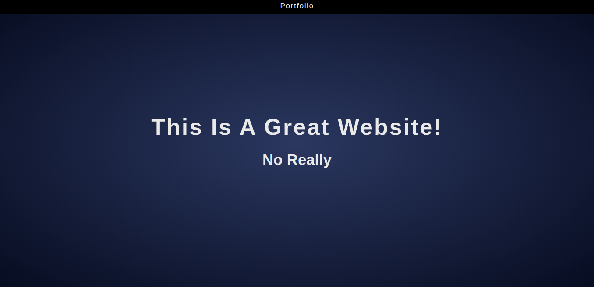

# Gulp 4.0

## Boilerplate description

This is a boilerplate for a Gulp files If you are lazy like me and are always on the watch out of how you can optimize your workflow as a web developer this is the right video for you.

Today we are going to learn what Gulp is and how you can use it to avoid boring repetitive steps especially in regards to deploying a html css javascript website.

Before we start, around two years ago gulp updated from version 3 to version 4.

If you see code on stack overflow or somewhere else on the internet like this, where there is no function statement in the beginning.

This is the old syntax which most probably is not going to work with Gulp 4.

So either install gulp 3 or learn here how it’s done with gulp version 4.

Here the steps:

1. Create package.json (npm init -y)
2. Install Gulp Globally (npm i gulp-cli -g)
3. CD in the project folder
4. Install Gulp as dev dependency
5. Create Gulpfile.js
6. Import gulp and deconstruct variables.
7. Let's go...

- **Plugins:** npm install --save-dev gulp gulp-sass gulp-sourcemaps gulp-postcss autoprefixer cssnano gulp-concat gulp-terser gulp-imagemin

- **Resources:** https://gulpjs.com/docs/en/getting-started/quick-start https://postcss.org/

## Notes

- Gulp is a toolkit for automating painful or time-consuming tasks in your development workflow, also known as a task runner.

- Some possible usages:

  - Image optimazation
  - Copy and rename files
  - Uglify (Minify) CSS
  - Concatenate JS

- Some alternatives to Gulp are:

  - Grunt
  - Webpack
  - Npm Scripts

- Top level functions:

  - **src():** the source points to the file we want to use.
  - **dest():** the dest points to the output folder.
  - **watch():** watch files and folders for changes.

- Syntax to run multiple functions after 'gulp': `exports.default = parallel(copyHtml, imgTask);`
- Syntax to run each function individually after 'gulp copyHtml': `exports.copyHtml = copyHtml;`

- After all we just have to upload the _disp_ folder to the server (and be happy)...

---

## :eyes: Preview

