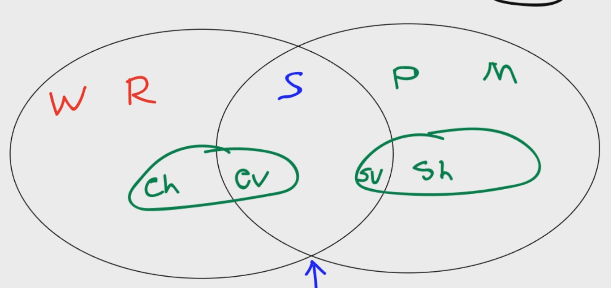

# WRSPM Model Notes

- World: The world assumptions which are used to develop the system. (Will there be internet? Electricity? What is the speed of the internet? )

- Requirements: Defining the problem at hand and how a solution to that problem should operate.

- Specifications: Defining the technical requirements of the system. Here we are linking together the idea of the solution, to the system itself.

- Program: The program and code itself.

- Machine: The physical hardware needed for the software. Servers, RAM, CPU, etc.

The WRSPM model helps define the problem better. Not only do we take into account the program we are building, we also consider things like the environment, and the actual hardware. Taking into account things like the environment can make very important distinctions to how the program is developed.

For example, lets say we are developing a software which handles user financial transactions. We as programmers assume that the system will always be connected to power. However, maybe this particular software is being developed for a place which has random blackouts. So at any time the power can be cut.

We now need to develop a software solution which has fail-safe features for if the power is suddenly cut off. Maybe this takes place at the terminal, or the server itself. However it's designed, it's important to know this constraint beforehand. The WRSPM model helps us answer these questions.

There are additional areas of classification we can use as well.

- Eh - Environment hidden. These are pieces of data within the environment, which are just concepts or ideas. For example, the password you have memorized for an account. This piece of information exists only within your mind. Therefore it's a variable, but hidden.

- Ev - Environment Visible. These are pieces of data within the environment which are now visible. Entering that password into a computer terminal manifests it. It is now represented in the physical world, and in a way which the system can now use.

- Sv - System Visible. This is the part of the system which is visible to the user. This includes the program and the machine. So the keyboard, monitor, mouse etc. It also covers the screens and part of the program which you can interact with.

- Sh - System Hidden. This is the part of the system which is hidden from the user. This includes the part of the software that the user doesn't touch, and the components within the machine itself. An example of this would be with a calculator. The user enters in the two numbers to be added. The hidden part is how the machine adds the numbers together before showing the result to the user.
